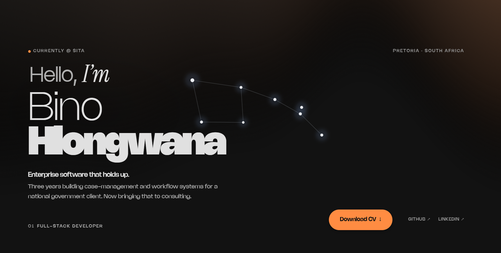
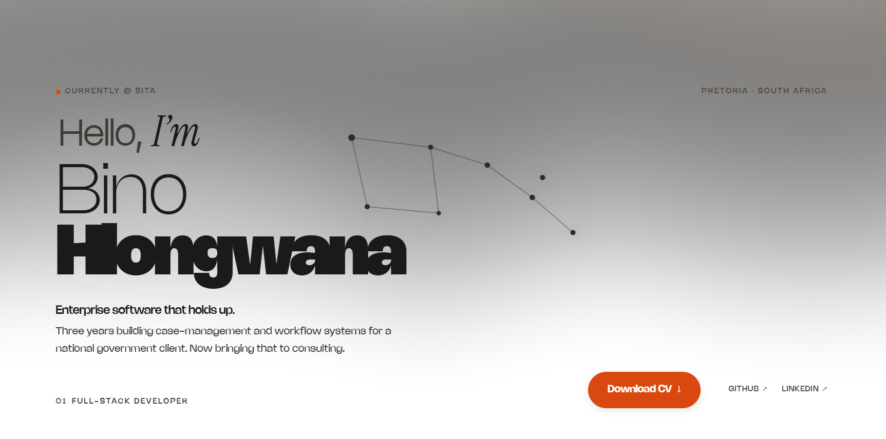

# Bino Hlongwana | Portfolio

A portfolio built as one continuous scrolling journey — four destinations (Home, Work, About, Contact) connected by a morphing star map and a WebGL aurora, looping seamlessly back to the start.


---

## ✨ Features

- **Looping Scroll** — The page scrolls through all four sections and wraps invisibly back to the top via a cloned seam, so the journey never ends
- **Morphing Star Map** — An SVG constellation interpolates between figures as you scroll, acting as wayfinding for where you are in the loop
- **WebGL Aurora** — A GLSL simplex-noise shader (via [OGL](https://github.com/oframe/ogl)) renders a living aurora behind every section
- **Single Frame Loop** — One shared `requestAnimationFrame` pulse runs outside Angular's zone and drives every animation, keeping change detection off the hot path
- **Theme Toggle** — Dark/light mode with system preference detection, `localStorage` persistence, and a signals-based `ThemeService` the whole app reacts to
- **Accessible** — Semantic HTML, ARIA labels, keyboard navigation, and full `prefers-reduced-motion` support (the morph and aurora settle down when asked)
- **Responsive** — Optimized layouts for desktop, tablet, and mobile
- **CV Download** — One click, straight to your downloads folder — recruiters, this one's for you ;)

---

## 🛠️ Tech Stack

| Category       | Technologies                                      |
|----------------|---------------------------------------------------|
| Framework      | Angular 19 (NgModules + Signals)                  |
| Language       | TypeScript 5.6                                    |
| Graphics       | OGL (WebGL2 shader), SVG morphing                 |
| Styling        | CSS3 (Custom Properties, Flexbox, Grid)           |
| Icons          | Font Awesome                                      |
| Testing        | Jasmine + Karma                                   |

---

## 🏗️ How It Works

The scroll loop is the spine of the site. `ScrollLoopService` owns the reader's **cycle position** (0 = Home, 1 = Work, … wrapping at the seam) with the arithmetic extracted into pure, unit-tested functions in `scroll-loop.math.ts`. The app shell feeds it raw scroll offsets; everything else — the constellation morph, the loop-aware nav muting — reads the position signal from a shared frame pulse without ever triggering change detection at 60fps.

Every significant design decision is recorded as an ADR in [docs/adr](docs/adr) — from the initial immersion-first concept to the seamless clone-wrap and the glass-card surface treatment.

---

## 📁 Project Structure
```
src/app/
├── aurora/                    # WebGL aurora background (OGL + GLSL shader)
├── constellation/             # Morphing star map (figures, morph driver, interpolation)
├── core/                      # FramePulseService (shared rAF), ThemeService
├── landingpage/               # Home / hero section + CV download
├── layout/site-nav/           # Navigation with loop-aware muting
├── pages/                     # work, about, contact
├── shared/                    # display-heading, theme-toggle
├── scroll-loop.service.ts     # Scroll cycle state + seam wrap
├── scroll-loop.math.ts        # Pure scroll math (unit-tested)
└── scroll-reveal.directive.ts # Fade-in-on-scroll behavior
docs/adr/                      # Architecture Decision Records
```

---

## 🏃 Getting Started

### Prerequisites

- Node.js (v18.19+)
- Angular CLI (`npm install -g @angular/cli`)

### Installation
```bash
# Clone the repository
git clone https://github.com/Robotbino/PorfolioWebsite.git

# Navigate to project directory
cd PorfolioWebsite

# Install dependencies
npm install

# Start development server
npm start
```

Visit `http://localhost:4200` in your browser.

### Tests
```bash
npm test
```
The scroll math, constellation morph, and frame pulse each have their own spec files.

---

## 📸 Screenshots

<details>
<summary>Click to expand</summary>

### Dark Mode


### Light Mode


</details>

---

## 📬 Contact

**Bino Hlongwana** :)

[](https://www.linkedin.com/in/bino-hlongwana-162226272)
[](https://github.com/Robotbino)
[](mailto:HlongwanaBino@gmail.com)

---

## 📄 License

This project is open source and available under the [MIT License](LICENSE).
