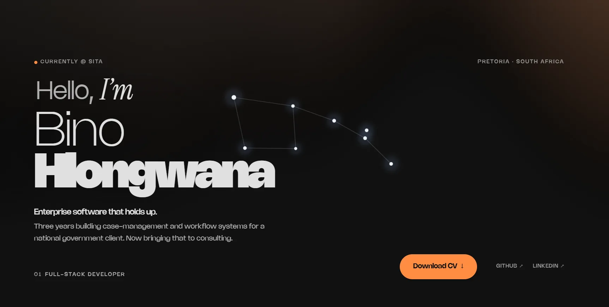
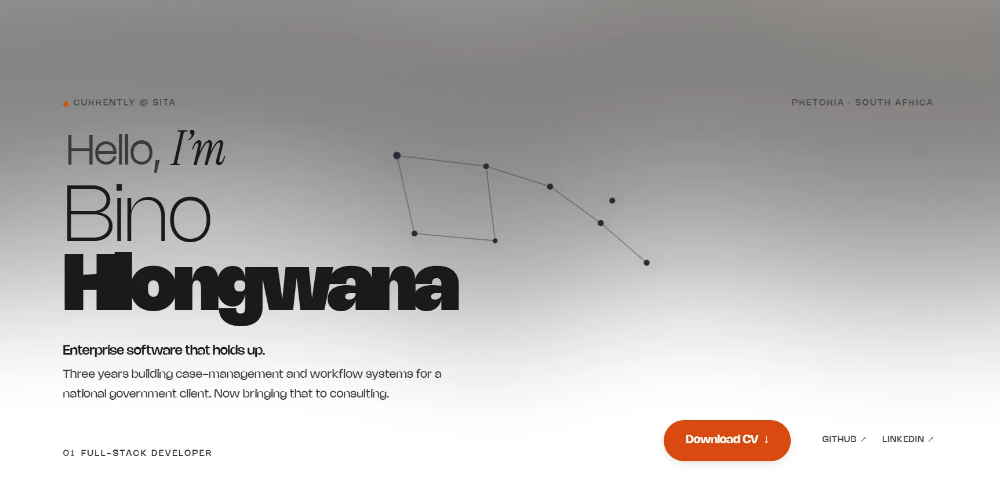

# Bino Hlongwana | Portfolio

A portfolio built as one continuous scrolling journey — five destinations (Home, Experience, About, Certifications, Contact) connected by a morphing star map and a WebGL aurora, looping seamlessly back to the start.

**→ [binohlongwana.netlify.app](https://binohlongwana.netlify.app/)**

[](https://binohlongwana.netlify.app/)


There is no router and there are no page loads. The whole site is a single scrolling loop whose
position is a signal, read every frame by a single shared `requestAnimationFrame` pulse running
outside Angular's zone. Everything below follows from that one decision.

---

## Contents

- [Start here: the onboarding doc](#-start-here-the-onboarding-doc)
- [Getting started](#-getting-started)
- [Features](#-features)
- [Tech stack](#️-tech-stack)
- [How it works](#️-how-it-works)
- [Project structure](#-project-structure)
- [Architecture decisions](#-architecture-decisions)
- [Deployment](#-deployment)
- [Screenshots](#-screenshots)

---

## 📚 Start Here: The Onboarding Doc

The best way to understand how everything works together is the **[interactive engineering onboarding guide](docs/onboarding.html)** — a self-contained HTML doc (no build step, no dependencies; just open `docs/onboarding.html` in any browser). It walks through:

- **Quick Start** — prerequisites, install & run, script reference, deployment
- **Architecture** — the star-map wayfinding concept, an interactive system diagram, the scroll loop that acts as the site's spine, signals and the 60fps hot path, and the theming model
- **Component Map** — a directory tour, why there is no router, every component, core service, and data file
- **Modification Guide** — step-by-step recipes for adding a project, updating certifications, tweaking the constellation, tuning the aurora, and adding a whole new destination

Supporting references:

- **[CONTEXT.md](CONTEXT.md)** — the design-language glossary
- **[docs/adr](docs/adr)** — Architecture Decision Records for every significant design choice

---

## 🏃 Getting Started

### Prerequisites

- Node.js v18.19+
- Angular CLI — `npm install -g @angular/cli`

### Install and run

```bash
git clone https://github.com/Robotbino/PorfolioWebsite.git
```

```bash
cd PorfolioWebsite && npm install && npm start
```

Visit `http://localhost:4200`.

### Scripts

| Script | What it does |
|---|---|
| `npm start` | Dev server with live reload on `:4200` |
| `npm run build` | Production build into `dist/professional-porfolio/browser` |
| `npm run watch` | Rebuilding development bundle, no server |
| `npm test` | Unit tests in Karma + Jasmine |

### Tests

```bash
npm test
```

The pure logic lives in unit-tested modules with colocated `.spec.ts` files — scroll math, the
constellation morph and its driver, the frame pulse, theme decisions, certifications math,
destinations, the aurora palette, in-viewport observation, scroll lock, and motion math. Anything
that can be a pure function is one, precisely so it can be tested without a DOM.

> **No Chrome installed?** Karma launches Chrome by default. Point it at another Chromium build
> first — for example, on Windows:
>
> ```bash
> CHROME_BIN="C:/Program Files (x86)/Microsoft/Edge/Application/msedge.exe" npm test
> ```

---

## ✨ Features

- **Looping Scroll** — The page scrolls through all five sections and wraps invisibly back to the top via a cloned seam, so the journey never ends
- **Morphing Star Map** — An SVG constellation interpolates between figures as you scroll, acting as wayfinding for where you are in the loop
- **WebGL Aurora** — A GLSL simplex-noise shader (via [OGL](https://github.com/oframe/ogl)) renders a living aurora behind every section; coarse-pointer devices get an animated CSS-gradient fallback instead of a shader
- **Single Frame Loop** — One shared `requestAnimationFrame` pulse runs outside Angular's zone and drives every animation, keeping change detection off the hot path
- **Horizontal Projects Showcase** — The Experience section pins and scrolls its project cards sideways on the same rAF pulse, with keyboard framing and a progress indicator
- **Certification Spotlight** — Each certification opens full-size in a focus-trapped overlay with a verify link; on fine pointers a floating preview tethers to the cursor
- **Marquee Email** — The Contact finale features a large marquee email with one-click copy-to-clipboard, plus a colophon with a live SAST clock
- **Theme Toggle** — Dark/light mode with system-preference detection, `localStorage` persistence, and a signals-based `ThemeService` the whole app reacts to
- **No Theme Flash** — An inline pre-paint guard in `index.html` sets the theme class before Angular boots, mirroring `theme.decision.ts`
- **Accessible** — Semantic HTML, ARIA labels, keyboard navigation, and full `prefers-reduced-motion` support (the morph and aurora settle down when asked)
- **Responsive** — Optimized layouts for desktop, tablet, and mobile
- **CV Download** — One click, straight to your downloads folder — recruiters, this one's for you ;)

---

## 🛠️ Tech Stack

| Category       | Technologies                                      |
|----------------|---------------------------------------------------|
| Framework      | Angular 19 (NgModules + Signals)                  |
| Language       | TypeScript 5.6                                    |
| Graphics       | OGL (WebGL2 shader), SVG morphing                 |
| Styling        | CSS3 (Custom Properties, Flexbox, Grid)           |
| Typography     | Nohemi (self-hosted, preloaded), Instrument Serif |
| Icons          | Font Awesome                                      |
| Testing        | Jasmine + Karma                                   |
| Hosting        | Netlify                                           |

Runtime dependencies are deliberately few: Angular, OGL, RxJS, and Font Awesome. No animation
library, no GSAP, no UI kit — the motion is hand-rolled against the shared frame pulse.

---

## 🏗️ How It Works

The scroll loop is the spine of the site. `ScrollLoopService` owns the reader's **cycle position**
(0 = Home, 1 = Experience, … wrapping at the seam), with the arithmetic extracted into pure,
unit-tested functions in `scroll-loop.math.ts`. The app shell feeds it raw scroll offsets;
everything else — the constellation morph, the loop-aware nav muting, the projects showcase —
reads the position signal from the shared frame pulse without ever triggering change detection
at 60fps.

Three rules keep that hot path honest:

1. **One pulse.** `FramePulseService` owns the only `requestAnimationFrame` loop; components
   subscribe to it rather than starting their own.
2. **One observer seam.** `InViewportService` owns viewport observation, so offscreen work pauses
   instead of burning frames.
3. **Pure math, testable.** Anything that can be a function of numbers is one: `scroll-loop.math.ts`,
   `motion.math.ts`, `certifications.math.ts`, `constellation-morph.ts`, `theme.decision.ts`.

There is deliberately **no Angular Router**: the five destinations are defined once in
`src/app/destinations.ts` and composed into a single looping page by the app shell. Adding a
destination means adding an entry there — the nav, the constellation, and the loop arithmetic all
derive from that list.

---

## 📁 Project Structure

```
src/app/
├── aurora/                    # WebGL aurora background (OGL + GLSL shader, coarse-pointer CSS fallback)
├── constellation/             # Morphing star map (figures, morph driver, interpolation)
├── core/                      # Services: frame pulse (shared rAF), theme, motion settings,
│                              #   in-viewport, scroll lock, nav transitions, aurora palette
├── landingpage/               # Home / hero section + CV download
├── layout/site-nav/           # Navigation with loop-aware muting
├── pages/
│   ├── work/                  # Experience timeline + horizontal showcase (work-data.ts)
│   ├── about/
│   ├── certifications/        # Spotlight overlay (certifications-data.ts, certifications.math.ts)
│   └── contact/               # Marquee email, channels, colophon with live SAST clock
├── shared/theme-toggle/
├── destinations.ts            # Single source of truth for the five destinations
├── scroll-loop.service.ts     # Scroll cycle state + seam wrap
├── scroll-loop.math.ts        # Pure scroll math (unit-tested)
├── motion.math.ts             # Frame-rate-independent smoothing (unit-tested)
└── scroll-reveal.directive.ts # Fade-in-on-scroll behavior
src/
├── assets/                    # CV, project shots, certificate images, self-hosted fonts
├── index.html                 # Font preloads + pre-paint theme guard
└── styles.css                 # Design tokens, @font-face, global type scale
docs/
├── onboarding.html            # ⭐ Interactive engineering onboarding guide — start here
└── adr/                       # Architecture Decision Records
CONTEXT.md                     # Design-language glossary
```

---

## 📐 Architecture Decisions

Every significant design decision is recorded as an ADR — including the ones that were tried and
rejected, because the trail is the point.

| ADR | Decision | Status |
|---|---|---|
| [0001](docs/adr/0001-full-multipage-immersion-first.md) | Full multipage routing, immersion-first | accepted, superseded by 0003 |
| [0002](docs/adr/0002-star-map-wayfinding-concept.md) | Star-map wayfinding as the unifying concept | accepted, revised by 0003 |
| [0003](docs/adr/0003-looping-scroll-real-constellations.md) | Looping-scroll immersion with real constellations | accepted |
| [0004](docs/adr/0004-seamless-loop-clone-wrap.md) | Seamless one-direction loop via a cloned Home buffer | accepted |
| [0005](docs/adr/0005-loop-aware-nav-muting.md) | Loop-aware (Home-anchored) navigation muting | accepted |
| [0006](docs/adr/0006-glass-card-surface.md) | Frosted-glass surface for content cards | **rejected** |
| [0007](docs/adr/0007-deepen-cycle-module.md) | Deepen the Cycle into `ScrollLoopService` | accepted |
| [0008](docs/adr/0008-projects-showcase-legibility.md) | Projects showcase — progress, focus, keyboard framing | accepted |

---

## 🚀 Deployment

Live at **[binohlongwana.netlify.app](https://binohlongwana.netlify.app/)**, deployed to **Netlify**
via [netlify.toml](netlify.toml):

- Build: `ng build --configuration production`
- Publish directory: `dist/professional-porfolio/browser`
- SPA fallback: `/* → /index.html 200` (also mirrored in `src/_redirects`)

---

## 📸 Screenshots

<details>
<summary>Click to expand</summary>

### Dark Mode


### Light Mode


</details>

---

## 📬 Contact

**Bino Hlongwana** :)

[](https://www.linkedin.com/in/bino-hlongwana-162226272)
[](https://github.com/Robotbino)
[](mailto:HlongwanaBino@gmail.com)

---

## 📄 License

This project is open source and available under the [MIT License](LICENSE).
